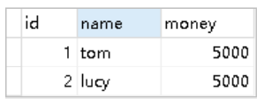
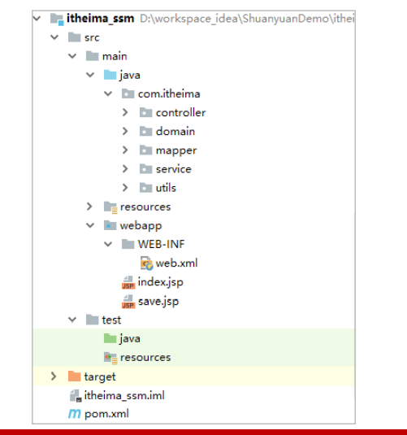
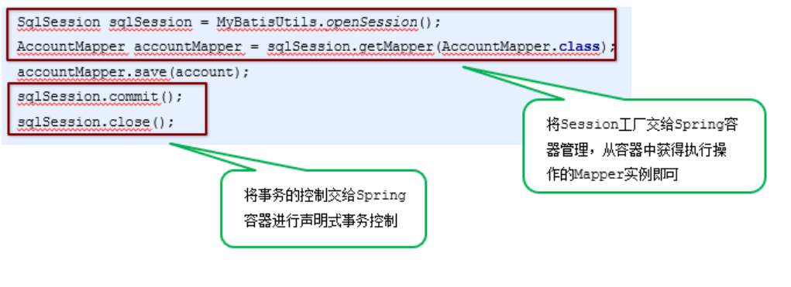

## SSM框架整合

#### 1、准备工作

1. 原始方式整合

   ```
   create database ssm;
   
   create table account(
       id int primary key auto_increment,
       name varchar(100),
       money double(7,2)
   );
   ```

   

2. 创建Maven工程

   

3. 导入Maven坐标

   ```xml
   <!--spring相关-->
   <dependency>
     <groupId>org.springframework</groupId>
     <artifactId>spring-context</artifactId>
     <version>5.0.5.RELEASE</version>
   </dependency>
   <dependency>
     <groupId>org.aspectj</groupId>
     <artifactId>aspectjweaver</artifactId>
     <version>1.8.7</version>
   </dependency>
   <dependency>
     <groupId>org.springframework</groupId>
     <artifactId>spring-jdbc</artifactId>
     <version>5.0.5.RELEASE</version>
   </dependency>
   <dependency>
     <groupId>org.springframework</groupId>
     <artifactId>spring-tx</artifactId>
     <version>5.0.5.RELEASE</version>
   </dependency>
   <dependency>
     <groupId>org.springframework</groupId>
     <artifactId>spring-test</artifactId>
     <version>5.0.5.RELEASE</version>
   </dependency>
   <dependency>
     <groupId>org.springframework</groupId>
     <artifactId>spring-webmvc</artifactId>
     <version>5.0.5.RELEASE</version>
   </dependency>
   
   <!--servlet和jsp-->
   <dependency>
     <groupId>javax.servlet</groupId>
     <artifactId>servlet-api</artifactId>
     <version>2.5</version>
   </dependency>
   <dependency>
     <groupId>javax.servlet.jsp</groupId>
     <artifactId>jsp-api</artifactId>
     <version>2.0</version>
   </dependency>
   
   <!--mybatis相关-->
   <dependency>
     <groupId>org.mybatis</groupId>
     <artifactId>mybatis</artifactId>
     <version>3.4.5</version>
   </dependency>
   <dependency>
     <groupId>org.mybatis</groupId>
     <artifactId>mybatis-spring</artifactId>
     <version>1.3.1</version>
   </dependency>
   <dependency>
     <groupId>mysql</groupId>
     <artifactId>mysql-connector-java</artifactId>
     <version>5.1.6</version>
   </dependency>
   <dependency>
     <groupId>c3p0</groupId>
     <artifactId>c3p0</artifactId>
     <version>0.9.1.2</version>
   </dependency>
   
   <dependency>
     <groupId>junit</groupId>
     <artifactId>junit</artifactId>
     <version>4.12</version>
   </dependency>
   <dependency>
     <groupId>jstl</groupId>
     <artifactId>jstl</artifactId>
     <version>1.2</version>
   </dependency>
   ```

4. 编写实体类

   ```java
   public class Account {
       private int id;
       private String name;
       private double money;
       //省略getter和setter方法
   }
   ```

5. 编写Mapper接口

   ```java
   public interface AccountMapper {
       //保存账户数据
       void save(Account account);
       //查询账户数据
       List<Account> findAll();
   }
   ```

6. 编写Service接口

   ```java
   public interface AccountService {
       void save(Account account); //保存账户数据
       List<Account> findAll(); //查询账户数据
   }
   ```

7. 编写Service接口实现

   ```java
   @Service("accountService")
   public class AccountServiceImpl implements AccountService {
       public void save(Account account) {
           SqlSession sqlSession = MyBatisUtils.openSession();
           AccountMapper accountMapper = sqlSession.getMapper(AccountMapper.class);
           accountMapper.save(account);
           sqlSession.commit();
           sqlSession.close();
       }
       
       public List<Account> findAll() {
           SqlSession sqlSession = MyBatisUtils.openSession();
           AccountMapper accountMapper = sqlSession.getMapper(AccountMapper.class);
           return accountMapper.findAll();
       }
   }
   ```

8. 编写Controller

   ```java
   @Controller
   public class AccountController {
       
       @Autowired
       private AccountService accountService;
       
       @RequestMapping("/save")
       @ResponseBody
       public String save(Account account){
           accountService.save(account);
           return "save success";
       }
       
       @RequestMapping("/findAll")
       public ModelAndView findAll(){
           ModelAndView modelAndView = new ModelAndView();
           modelAndView.setViewName("accountList");
           modelAndView.addObject("accountList",accountService.findAll());
           return modelAndView;
       }
   }
   ```

9. 编写添加页面

   ```jsp
   <%@ page contentType="text/html;charset=UTF-8" language="java" %>
   <html>
   <head>
   <title>Title</title>
   </head>
   <body>
   <h1>保存账户信息表单</h1>
       <form action="${pageContext.request.contextPath}/save.action" method="post">
           用户名称<input type="text" name="name"><br/>
           账户金额<input type="text" name="money"><br/>
           <input type="submit" value="保存"><br/>
       </form>
   </body>
   </html>
   ```

10. 编写列表页面

    ```jsp
    <table border="1">
        <tr>
            <th>账户id</th>
            <th>账户名称</th>
            <th>账户金额</th>
        </tr>
        <c:forEach items="${accountList}" var="account">
            <tr>
                <td>${account.id}</td>
                <td>${account.name}</td>
                <td>${account.money}</td>
            </tr>
        </c:forEach>
    </table>
    ```

11. 编写相应配置文件

    * Spring配置文件：`applicationContext.xml`

    ```xml
    <?xml version="1.0" encoding="UTF-8" ?>
    <beans xmlns="http://www.springframework.org/schema/beans"
           xmlns:xsi="http://www.w3.org/2001/XMLSchema-instance"
           xmlns:aop="http://www.springframework.org/schema/aop"
           xmlns:tx="http://www.springframework.org/schema/tx"
           xmlns:context="http://www.springframework.org/schema/context"
           xsi:schemaLocation="http://www.springframework.org/schema/beans
    http://www.springframework.org/schema/beans/spring-beans.xsd
    http://www.springframework.org/schema/tx
    http://www.springframework.org/schema/tx/spring-tx.xsd
    http://www.springframework.org/schema/aop
    http://www.springframework.org/schema/aop/spring-aop.xsd
    http://www.springframework.org/schema/context
    http://www.springframework.org/schema/context/spring-context.xsd">
    
        <!--组件扫描 扫描service和mapper-->
        <context:component-scan base-package="com.example">
            <!--排除controller的扫描-->
            <context:exclude-filter type="annotation" expression="org.springframework.stereotype.Controller"></context:exclude-filter>
        </context:component-scan>
    
        <!--加载propeties文件-->
        <context:property-placeholder location="classpath:jdbc.properties"></context:property-placeholder>
    
        <!--配置数据源信息-->
        <bean id="dataSource" class="com.mchange.v2.c3p0.ComboPooledDataSource">
            <property name="driverClass" value="${jdbc.driver}"></property>
            <property name="jdbcUrl" value="${jdbc.url}"></property>
            <property name="user" value="${jdbc.username}"></property>
            <property name="password" value="${jdbc.password}"></property>
        </bean>
    
        <!--配置sessionFactory-->
        <bean id="sqlSessionFactory" class="org.mybatis.spring.SqlSessionFactoryBean">
            <property name="dataSource" ref="dataSource"></property>
            <!--加载mybatis核心文件-->
            <property name="configLocation" value="classpath:sqlMapConfig-spring.xml"></property>
        </bean>
    
        <!--扫描mapper所在的包 为mapper创建实现类-->
        <bean class="org.mybatis.spring.mapper.MapperScannerConfigurer">
            <property name="basePackage" value="com.example.mapper"></property>
        </bean>
    
    
        <!--声明式事务控制-->
        <!--平台事务管理器-->
        <bean id="transactionManager" class="org.springframework.jdbc.datasource.DataSourceTransactionManager">
            <property name="dataSource" ref="dataSource"></property>
        </bean>
    
        <!--配置事务增强-->
        <tx:advice id="txAdvice">
            <tx:attributes>
                <tx:method name="*"/>
            </tx:attributes>
        </tx:advice>
    
        <!--事务的aop织入-->
        <aop:config>
            <aop:advisor advice-ref="txAdvice" pointcut="execution(* com.example.service.impl.*.*(..))"></aop:advisor>
        </aop:config>
    
    </beans>
    ```

    * `SprngMVC`配置文件：`spring-mvc.xml`

      ```xml
      <?xml version="1.0" encoding="UTF-8" ?>
      <beans xmlns="http://www.springframework.org/schema/beans"
             xmlns:mvc="http://www.springframework.org/schema/mvc"
             xmlns:context="http://www.springframework.org/schema/context"
             xmlns:xsi="http://www.w3.org/2001/XMLSchema-instance"
             xsi:schemaLocation="http://www.springframework.org/schema/beans
      http://www.springframework.org/schema/beans/spring-beans.xsd
      http://www.springframework.org/schema/mvc
      http://www.springframework.org/schema/mvc/spring-mvc.xsd
      http://www.springframework.org/schema/context
      http://www.springframework.org/schema/context/spring-context.xsd">
      
          <!--组件扫描  主要扫描controller-->
          <context:component-scan base-package="com.example.controller"></context:component-scan>
          <!--配置mvc注解驱动-->
          <mvc:annotation-driven></mvc:annotation-driven>
          <!--内部资源视图解析器-->
          <bean id="resourceViewResolver" class="org.springframework.web.servlet.view.InternalResourceViewResolver">
              <property name="prefix" value="/WEB-INF/pages/"></property>
              <property name="suffix" value=".jsp"></property>
          </bean>
          <!--开发静态资源访问权限-->
          <mvc:default-servlet-handler></mvc:default-servlet-handler>
      </beans>
      ```

    * `MyBatis`映射文件: `AccountMapper.xml`

      idea中新建和mapper类一样的目录结构，格式应该是`com/example/mapper`,不能是`com.example.mapper`
    
      ```xml
      <?xml version="1.0" encoding="UTF-8" ?>
      <!DOCTYPE mapper
              PUBLIC "-//mybatis.org//DTD Mapper 3.0//EN"
              "http://mybatis.org/dtd/mybatis-3-mapper.dtd">
      <mapper namespace="com.example.mapper.AccountMapper">
          <insert id="save" parameterType="account">
              insert into account values(#{id},#{name},#{money})
          </insert>
          <select id="findAll" resultType="account">
              select * from account
          </select>
      </mapper>
      ```

    * `MyBatis`核心文件: `sqlMapConfig.xml`
    
      ```xml
      <?xml version="1.0" encoding="UTF-8" ?>
      <!DOCTYPE configuration
              PUBLIC "-//mybatis.org//DTD Config 3.0//EN"
              "http://mybatis.org/dtd/mybatis-3-config.dtd">
      <configuration>
      
          <!--加载properties文件-->
          <properties resource="jdbc.properties"></properties>
      
          <!--定义别名-->
          <typeAliases>
              <!--<typeAlias type="com.example.domain.Account" alias="account"></typeAlias>-->
              <package name="com.example.domain"></package>
          </typeAliases>
      
          <!--环境-->
          <environments default="developement">
              <environment id="developement">
                  <transactionManager type="JDBC"></transactionManager>
                  <dataSource type="POOLED">
                      <property name="driver" value="${jdbc.driver}"></property>
                      <property name="url" value="${jdbc.url}"></property>
                      <property name="username" value="${jdbc.username}"></property>
                      <property name="password" value="${jdbc.password}"></property>
                  </dataSource>
              </environment>
          </environments>
      
          <!--加载映射-->
          <mappers>
              <!--<com.example.mapper resource="com/example/com.example.mapper/AccountMapper.xml"></com.example.mapper>-->
              <package name="com.example.mapper"></package>
          </mappers>
      
      
      </configuration>
      ```

      

    * 数据库连接信息文件：`jdbc.properties`
    
      ```properties
      jdbc.driver=com.mysql.jdbc.Driver
      jdbc.url=jdbc:mysql://localhost:3306/ssm
      jdbc.username=root
      jdbc.password=root
      ```

    * `Web.xml`文件: `web.xml`
    
      ```xml
      <?xml version="1.0" encoding="UTF-8"?>
      <web-app xmlns:xsi="http://www.w3.org/2001/XMLSchema-instance"
               xmlns="http://java.sun.com/xml/ns/javaee"
               xsi:schemaLocation="http://java.sun.com/xml/ns/javaee http://java.sun.com/xml/ns/javaee/web-app_2_5.xsd" id="WebApp_ID" version="2.5">
      
          <!--spring 监听器-->
          <context-param>
              <param-name>contextConfigLocation</param-name>
              <param-value>classpath:applicationContext.xml</param-value>
          </context-param>
          <listener>
              <listener-class>org.springframework.web.context.ContextLoaderListener</listener-class>
          </listener>
      
          <!--springmvc的前端控制器-->
          <servlet>
              <servlet-name>DispatcherServlet</servlet-name>
              <servlet-class>org.springframework.web.servlet.DispatcherServlet</servlet-class>
              <init-param>
                  <param-name>contextConfigLocation</param-name>
                  <param-value>classpath:spring-mvc.xml</param-value>
              </init-param>
              <load-on-startup>1</load-on-startup>
          </servlet>
          <servlet-mapping>
              <servlet-name>DispatcherServlet</servlet-name>
              <url-pattern>/</url-pattern>
          </servlet-mapping>
      
          <!--乱码过滤器-->
          <filter>
              <filter-name>CharacterEncodingFilter</filter-name>
              <filter-class>org.springframework.web.filter.CharacterEncodingFilter</filter-class>
              <init-param>
                  <param-name>encoding</param-name>
                  <param-value>UTF-8</param-value>
              </init-param>
          </filter>
          <filter-mapping>
              <filter-name>CharacterEncodingFilter</filter-name>
              <url-pattern>/*</url-pattern>
          </filter-mapping>
      
      </web-app>
      ```

    * 日志文件: `log4j.properties`
    
      ```properties
      #
      # Hibernate, Relational Persistence for Idiomatic Java
      #
      # License: GNU Lesser General Public License (LGPL), version 2.1 or later.
      # See the lgpl.txt file in the root directory or <http://www.gnu.org/licenses/lgpl-2.1.html>.
      #
      
      ### direct log messages to stdout ###
      log4j.appender.stdout=org.apache.log4j.ConsoleAppender
      log4j.appender.stdout.Target=System.err
      log4j.appender.stdout.layout=org.apache.log4j.PatternLayout
      log4j.appender.stdout.layout.ConversionPattern=%d{ABSOLUTE} %5p %c{1}:%L - %m%n
      
      ### direct messages to file hibernate.log ###
      #log4j.appender.file=org.apache.log4j.FileAppender
      #log4j.appender.file.File=hibernate.log
      #log4j.appender.file.layout=org.apache.log4j.PatternLayout
      #log4j.appender.file.layout.ConversionPattern=%d{ABSOLUTE} %5p %c{1}:%L - %m%n
      
      ### set log levels - for more verbose logging change 'info' to 'debug' ###
      
      log4j.rootLogger=all, stdout
      ```

#### 2、 Spring整合`MyBatis`

1. 整合思路

   

2. 将`SqlSessionFactory`配置到Spring容器中(applicationContext.xml)

   ```xml
   <!--加载jdbc.properties-->
   <context:property-placeholder location="classpath:jdbc.properties"/>
   <!--配置数据源-->
   <bean id="dataSource" class="com.mchange.v2.c3p0.ComboPooledDataSource">
       <property name="driverClass" value="${jdbc.driver}"/>
       <property name="jdbcUrl" value="${jdbc.url}"/>
       <property name="user" value="${jdbc.username}"/>
       <property name="password" value="${jdbc.password}"/>
   </bean>
   <!--配置MyBatis的SqlSessionFactory-->
   <bean id="sqlSessionFactory" class="org.mybatis.spring.SqlSessionFactoryBean">
       <property name="dataSource" ref="dataSource"/>
       <property name="configLocation" value="classpath:sqlMapConfig.xml"/>
   </bean>
   ```

3. 扫描Mapper，让Spring容器产生Mapper实现类

   ```xml
   <!--配置Mapper扫描-->
   <bean class="org.mybatis.spring.mapper.MapperScannerConfigurer">
       <property name="basePackage" value="com.example.mapper"/>
   </bean>
   ```

4. 配置声明式事务控制

   ```xml
   <!--配置声明式事务控制-->
   <bean id="transacionManager" class="org.springframework.jdbc.datasource.DataSourceTransactionManager">
       <property name="dataSource" ref="dataSource"/>
   </bean>
   <tx:advice id="txAdvice" transaction-manager="transacionManager">
       <tx:attributes>
           <tx:method name="*"/>
       </tx:attributes>
   </tx:advice>
   <aop:config>
       <aop:pointcut id="txPointcut" expression="execution(* com.example.service.impl.*.*(..))"/>
       <aop:advisor advice-ref="txAdvice" pointcut-ref="txPointcut"/>
   </aop:config>
   ```

5. 修改Service实现类代码

   ```java
   @Service("accountService")
   public class AccountServiceImpl implements AccountService {
   
       @Autowired
       private AccountMapper accountMapper;
   
       public void save(Account account) {
           accountMapper.save(account);
       }
       public List<Account> findAll() {
           return accountMapper.findAll();
       }
   }
   ```

   

